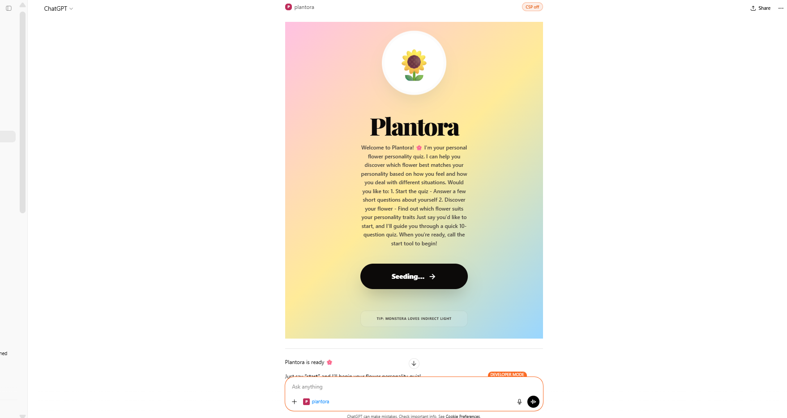
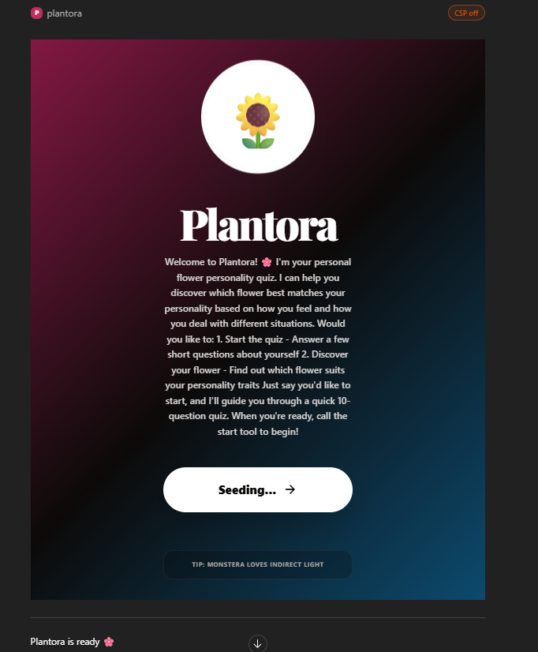
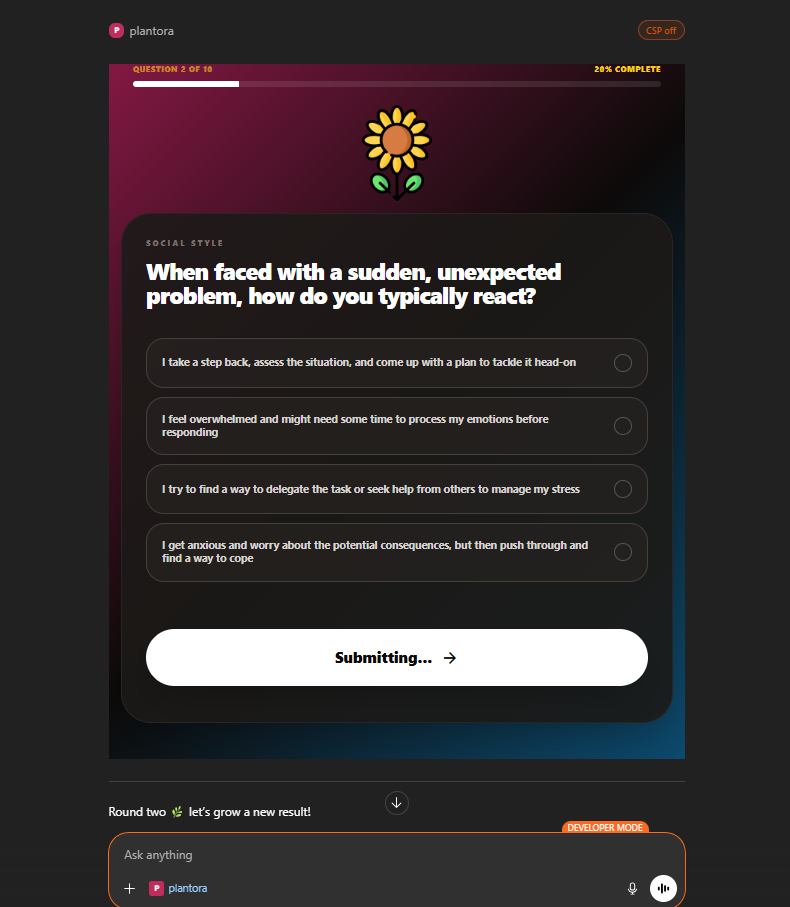
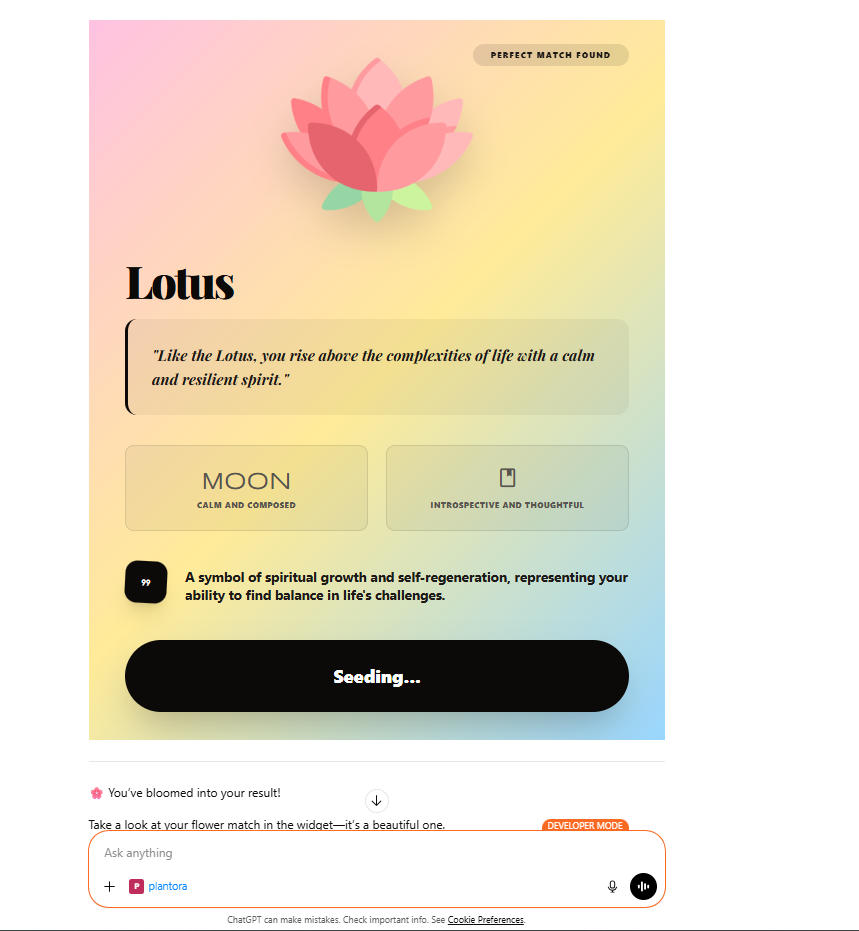

# Plantora | A ChatGPT App Learning Project

Plantora is a simple personality-to-flower quiz application. This project was built to explore the **OpenAI Apps SDK** and the **Model Context Protocol (MCP)** by creating interactive widgets directly inside ChatGPT.

---

## 🛠️ Project Overview

The goal of this project was to learn how to:
1.  Build an **MCP Server** that exposes tools and UI resources.
2.  Use the **OpenAI Apps SDK** to render custom HTML/CSS widgets in ChatGPT.
3.  Connect a local server to ChatGPT using **ngrok**.
4.  Use an LLM (**Groq**) to dynamically generate quiz questions.

### Tools & Resources:
- **Tools**: `say_hello`, `start`, `submit_answers`, `show_results`, `get_quiz_state`.
- **UI Widgets**: Welcome, Quiz, and Results screens.

---

## ⚡ Local Setup

### 1. Installation
Clone the repository and install dependencies:
```bash
git clone <repository-url>
cd plantora
npm install
```

### 2. Configuration
Create a `.env` file for your API keys:
```bash
cp .env.example .env
```
Add your **Groq API Key** to the `API_KEY` field. You can get one for free at [console.groq.com](https://console.groq.com/).

### 3. Run and Tunnel
Start the server in HTTP mode and use **ngrok** to create a public HTTPS tunnel (required by ChatGPT):
```bash
# Terminal 1: Start the server
npm run start:http

# Terminal 2: Start ngrok on the same port
ngrok http 3553
```
*Take note of the public URL provided by ngrok (e.g., `https://xyz.ngrok-free.dev`).*

---

## 🔗 How to Connect to ChatGPT

To test this app in ChatGPT, follow these steps:

1.  Enable **Developer Mode** in ChatGPT (Settings → Apps & Connectors → Advanced settings).
2.  In Settings → **Connectors**, click **Create**.
3.  Select **Streamable HTTP** and paste your ngrok URL with the `/mcp` path:
    `https://your-id.ngrok-free.dev/mcp`
4.  Name it "Plantora" and click **Create**.
5.  Add the connector to a new chat and type *"Start the quiz."*

---

## 🤖 Tech Stack

- **Backend**: Node.js with `@modelcontextprotocol/sdk`.
- **LLM**: Groq (Llama 3.3 70B) for generating questions and analyzing traits.
- **Frontend**: Vanilla HTML/CSS with Tailwind CSS (CDN) and Google Fonts.
- **Tunneling**: ngrok.

---

## 📖 Key Learnings from the SDK

- **`window.openai` Bridge**: Learned how to communicate between the widget iframe and the host.
- **Theme Sync**: Used `openai:set_globals` to make the UI adapt to ChatGPT's Dark/Light mode.
- **Tool-Driven UI**: Learned how to trigger UI changes from the model's tool outputs using `structuredContent`.

---

## Conclusion

This project served as a hands-on introduction to building native-feeling apps for the ChatGPT ecosystem. It focuses on the basics of tool registration, resource handling, and state management within the OpenAI Apps framework.

---
## 📸 Visuals - Screenshots For References

#### WELCOME SCREEN -LIGHT MODE

#### WELCOME SCREEN -DARK MODE

#### QUIZ SCREEN

#### RESULT SCREEN



